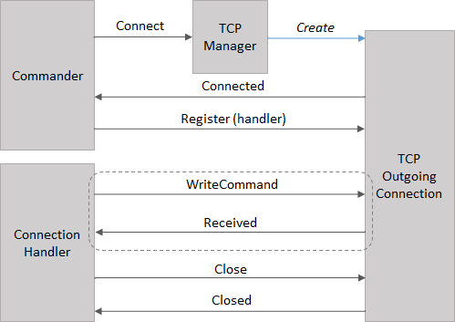
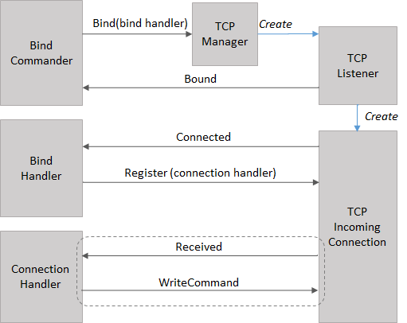

## Akka I/O

The I/O extension provides an non-blocking, event driven API that matches the underlying transports mechanism.

Detail of the I/O extension's design can be found in the [Akka JVM documentation](http://doc.akka.io/docs/akka/snapshot/dev/io-layer.html#io-layer).

### Getting Started
Every I/O Driver has a special actor, called the _manager_, that serves as an entry point for the API.
The _manager_ for a particular driver is accessible through an extension method on _ActorSystem_. The following example shows how to get a reference to the TCP manager.

```csharp
using Akka.Actor;
using Akka.IO;

...

var system = ActorSystem.Create("example");
var manager = system.Tcp();

```

#### TCP Driver

##### Client Connection
To create a connection an actor sends a _Tcp.Connect_ message to the TCP Manager.
Once the connection is established the connection actor sends a _Tcp.Connected_ message to the _commander_, which registers the _connection handler_ by replying with a _Tcp.Register_ message.

Once this handshake is completed, the handler and connection communicate with _Tcp.WriteCommand_ and _Tcp.Received_ messages.

The following diagram illustrate the actors involved in establishing and handling a connection.



The following example shows a simple Telnet client. The client send lines entered in the console to the TCP connection, and write data received from the network to the console.

```csharp
class TelnetClient : UntypedActor
{
    public TelnetClient(string host, int port)
    {
        var endpoint = new DnsEndPoint(host, port);
        Context.System.Tcp().Tell(new Tcp.Connect(endpoint));
    }

    protected override void OnReceive(object message)
    {
        if (message is Tcp.Connected)
        {
            var connected = message as Tcp.Connected;
            Console.WriteLine("Connected to {0}", connected.RemoteAddress);

            // Register self as connection handler
            Sender.Tell(new Tcp.Register(Self));  
            ReadConsoleAsync();
            Become(Connected(Sender));
        }
        else if (message is Tcp.CommandFailed)
        {
            Console.WriteLine("Connection failed");
        }
        else Unhandled(message);
    }

    private UntypedReceive Connected(IActorRef connection)
    {
        return message =>
        {
            if (message is Tcp.Received)  // data received from network
            {
                var received = message as Tcp.Received;
                Console.WriteLine(Encoding.ASCII.GetString(received.Data.ToArray()));
            }
            else if (message is string)   // data received from console
            {
                connection.Tell(Tcp.Write.Create(ByteString.FromString((string)message + "\n")));
                ReadConsoleAsync();
            }
            else if (message is Tcp.PeerClosed)
            {
                Console.WriteLine("Connection closed");
            }
            else Unhandled(message);
        };
    }

    private void ReadConsoleAsync()
    {
        Task.Factory.StartNew(self => Console.In.ReadLineAsync().PipeTo((ICanTell)self), Self);
    }
}
```

##### Server Connection
To accept connections, an actor sends an _Tcp.Bind_ message to the TCP manager, passing the _bind handler_ in the message.
The _bind commander_ will receive a _Tcp.Bound_ message when the connection is listening.

The _bind handler_ will receive a _Tcp.Connected_ message for each accepted connection, and needs to register the connection handler by replying with a _Tcp.Register_ message. Thereafter it proceeds the same as a client connection.

The following diagram illustrate the actor and messages.



The following code example shows a simple server that echo's data received from the network.

```csharp
class EchoServer : UntypedActor
{
    public EchoServer(int port)
    {
        Context.System.Tcp().Tell(new Tcp.Bind(Self, new IPEndPoint(IPAddress.Any, port)));
    }

    protected override void OnReceive(object message)
    {
        if (message is Tcp.Bound)
        {
            var bound = message as Tcp.Bound;
            Console.WriteLine("Listening on {0}", bound.LocalAddress);
        }
        else if (message is Tcp.Connected)
        {
            var connection = Context.ActorOf(Props.Create(() => new EchoConnection(Sender)));
            Sender.Tell(new Tcp.Register(connection));
        }
        else Unhandled(message);
    }
}

class EchoConnection : UntypedActor
{
    private readonly IActorRef _connection;

    public EchoConnection(IActorRef connection)
    {
        _connection = connection;
    }

    protected override void OnReceive(object message)
    {
        if (message is Tcp.Received)
        {
            var received = message as Tcp.Received;
            if (received.Data.Head == 'x')
                Context.Stop(Self);
            else
                _connection.Tell(Tcp.Write.Create(received.Data));
        }
        else Unhandled(message);
    }
}
```

### Akka IO Transport
The AkkaIOTransport contrib project implements an Akka Remote transport based on the I/O extension.
The following shows how to configure Akka Remote to use the IO Transport.

```hocon
akka {
    actor {
        provider = "Akka.Remote.RemoteActorRefProvider, Akka.Remote"
    }

    remote {
        enabled-transports = ["akka.remote.akka-io"]

        akka-io {
            transport-class = "Akka.Remote.AkkaIOTransport.AkkaIOTransport, Akka.Remote.AkkaIOTransport"
            hostname = "127.0.0.1"
            port = 9098
        }
    }
}
```
